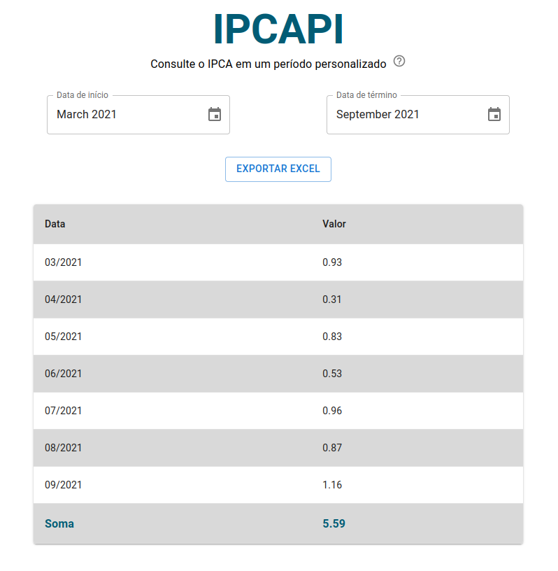
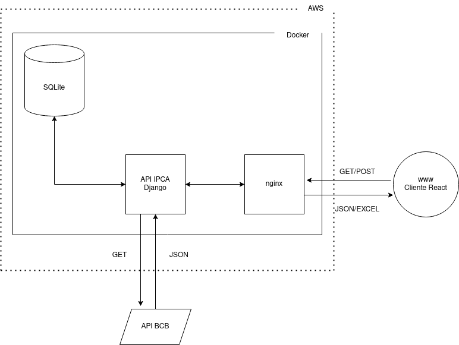

# IPCAPI

Uma aplicação web para consultas ao IPCA em um determinado período.

[http://ec2-3-16-137-212.us-east-2.compute.amazonaws.com/](http://ec2-3-16-137-212.us-east-2.compute.amazonaws.com/)



## Descrição

O IPCAPI consulta a API do Banco Central do Brasil para extrair dados do IPCA e disponibilizá-los ao usuário.

O usuário deve escolher um período de até um ano para a consulta e os dados serão atualizados automaticamente. Também é possível exportar os dados visualizados em uma planilha Excel (.xslx).

## Links

- [Cliente](http://ec2-3-16-137-212.us-east-2.compute.amazonaws.com/)
- [Figma](https://www.figma.com/file/5bxOpLhkm8rE4B7ucYHqUT/IPCAPI?node-id=0%3A1)
- [Postman](./api/MCS.postman_collection.json)
- [Jira](./documentation/jira.png)

## Development

Para rodar cliente e api:

```
docker-compose -f docker-compose.dev.yml up -d --build
```

Testes

```
docker-compose -f docker-compose.dev.yml run api python manage.py test
docker-compose -f docker-compose.dev.yml run client npm run test
```

## Production

```
docker-compose up -d --build
```

## Environment

Criar um arquivo .env na raíz com o conteúdo:

```
DJANGO_KEY=<secret_key>
DJANGO_ENV=<DEV ou PROD>
```

## API

A api possui um único endpoint `/ipca`, que aceita requisições `GET` ou `POST`.

- GET
  - retorna a lista com todos os dados de IPCA encontrados no banco (esse endpoint não é utilizado pelo cliente).
  - returna 200 em caso de sucesso.
  - formato da resposta:
  ```ts
  [
      {
          id: string
          data: string // formato mm-dd-yyyy
          valor: string
      }
  ]
  ```

- POST
    - retorna uma lista com os dados de IPCA em um determinado período
    - formado do corpo da requisição:
    ```ts
  [
        {
        "start": "01/01/2021", // formato dd/mm/yyyy
        "end": "01/12/2021" // formato dd/mm/yyyy
        }
  ]
  ```
    - aceita o parâmetro `format` na URL, para retornar json ou .xlsx.
        - `/ipca?format=xlsx` para retornar os dados em uma planilha .xlsx.
        - json é o formato default.
    - retorna 200 em caso de sucesso.
    - formato da resposta:
  ```ts
  [
      {
          id: string
          data: string // formato mm-dd-yyyy
          valor: string
      }
  ]
  ```
  - retorna 400 em caso de request inválido.
    - formato da resposta:
  ```ts
  [
      {
          error: string
      }
  ]
  ```

## Dados

Os dados foram inicialmente extraídos diretamente da [API do BCB](https://api.bcb.gov.br/dados/serie/bcdata.sgs.433/dados) com o script [scrap_bcb](./api/ipca/management/commands/scrap_bcb.py).

Em seguida, o script [scrap_daily](./api/ipca/management/commands/scrap_daily.py) faz uma requisição diária a API do BCB, agendada via cron, para manter o banco de dados atualizado.

## Estrutura


